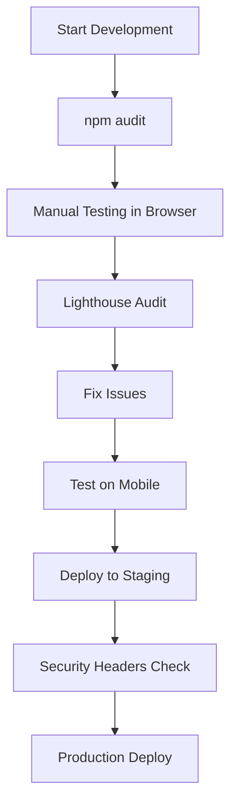

# Testing Tools & Guide for EduNize Web App

## ✅ Your Current Security Status
**npm audit result:** ✅ **0 vulnerabilities found** - Your dependencies are secure!

---

## 🛠️ Essential Testing Tools (Free & Easy)

### 1. **Chrome DevTools** ⭐ RECOMMENDED
**Already installed** - Built into Chrome/Edge browser

**What it tests:**
- Console errors
- Network requests
- Performance
- Security headers
- localStorage/cookies
- Mobile responsiveness

**How to use:**
```
1. Open your app: http://localhost:5173
2. Press F12 or Ctrl+Shift+I
3. Navigate through tabs:
   - Console: Check for errors
   - Network: Monitor API calls
   - Application: View localStorage
   - Lighthouse: Run audit
```

---

### 2. **Lighthouse** ⭐ RECOMMENDED
**Already installed** - Built into Chrome DevTools

**What it tests:**
- Performance score
- Accessibility
- Best practices
- SEO
- Progressive Web App

**How to use:**
```
Method 1 (In Browser):
1. Open Chrome DevTools (F12)
2. Click "Lighthouse" tab
3. Select categories to test
4. Click "Generate report"

Method 2 (Command Line):
npm install -g lighthouse
lighthouse http://localhost:5173 --view
```

**Target Scores:**
- Performance: 90+
- Accessibility: 90+
- Best Practices: 90+
- SEO: 90+

---

### 3. **npm audit** ⭐ ALREADY RAN
**What it tests:** Dependency vulnerabilities

**How to use:**
```bash
# Check for vulnerabilities
npm audit

# Fix vulnerabilities automatically
npm audit fix

# View detailed report
npm audit --json
```

**Your result:** ✅ 0 vulnerabilities

---

### 4. **React Developer Tools**
**Browser extension** for debugging React apps

**Install:**
- Chrome: https://chrome.google.com/webstore (search "React Developer Tools")
- Firefox: https://addons.mozilla.org/firefox (search "React Developer Tools")

**What it tests:**
- Component hierarchy
- Props and state
- Performance profiling
- Hook debugging

---

## 🔒 Security Testing Tools

### 5. **Security Headers Check**
**Online tool** - No installation needed

**Website:** https://securityheaders.com/

**How to use:**
```
1. Deploy your app to a test server (or use ngrok for localhost)
2. Go to https://securityheaders.com/
3. Enter your URL
4. Get security grade (A+ is best)
```

**What it checks:**
- Content-Security-Policy ✅ (You have this!)
- X-Frame-Options
- X-Content-Type-Options
- Strict-Transport-Security
- Referrer-Policy

---

### 6. **SSL Labs** (For HTTPS Testing)
**Online tool** - Tests SSL/TLS configuration

**Website:** https://www.ssllabs.com/ssltest/

**When to use:** After deploying to production with HTTPS

---

### 7. **WAVE** (Accessibility Testing)
**Browser extension** - Tests accessibility

**Install:** https://wave.webaim.org/extension/

**What it tests:**
- Screen reader compatibility
- Color contrast
- ARIA labels
- Keyboard navigation

---

## 🧪 Automated Testing Tools

### 8. **Vitest** (Unit Testing)
**Install and setup:**
```bash
npm install -D vitest @testing-library/react @testing-library/jest-dom
```

**Create test file:** `src/utils/validation.test.ts`
```typescript
import { describe, it, expect } from 'vitest';
import { validateEmail, validatePassword } from './validation';

describe('Validation', () => {
  it('validates email correctly', () => {
    expect(validateEmail('test@example.com')).toBe(true);
    expect(validateEmail('invalid')).toBe(false);
  });

  it('validates password strength', () => {
    const result = validatePassword('Weak1');
    expect(result.isValid).toBe(false);
    
    const strong = validatePassword('Strong123!');
    expect(strong.isValid).toBe(true);
  });
});
```

**Run tests:**
```bash
npx vitest
```

---

### 9. **Playwright** (E2E Testing)
**Install:**
```bash
npm install -D @playwright/test
npx playwright install
```

**Create test:** `tests/auth.spec.ts`
```typescript
import { test, expect } from '@playwright/test';

test('user can sign up', async ({ page }) => {
  await page.goto('http://localhost:5173');
  await page.click('text=Sign Up');
  await page.fill('input[type="email"]', 'test@example.com');
  await page.fill('input[type="password"]', 'Password123!');
  await page.click('button[type="submit"]');
  await expect(page).toHaveURL(/.*dashboard/);
});
```

**Run tests:**
```bash
npx playwright test
```

---

## 🌐 Cross-Browser Testing

### 10. **BrowserStack** (Free for open source)
**Website:** https://www.browserstack.com/

**What it tests:**
- Different browsers (Chrome, Firefox, Safari, Edge)
- Different devices (iPhone, Android, tablets)
- Different OS versions

**Free alternative:** Use browser DevTools device emulation

---

## 🚀 Performance Testing

### 11. **WebPageTest**
**Online tool** - Detailed performance analysis

**Website:** https://www.webpagetest.org/

**What it tests:**
- Load time
- First contentful paint
- Time to interactive
- Bundle size

---

### 12. **Bundle Analyzer**
**Analyze your build size**

**Install:**
```bash
npm install -D rollup-plugin-visualizer
```

**Add to `vite.config.ts`:**
```typescript
import { visualizer } from 'rollup-plugin-visualizer';

export default defineConfig({
  plugins: [
    react(),
    visualizer({ open: true })
  ]
});
```

**Run:**
```bash
npm run build
```

---

## 📱 Mobile Testing

### 13. **ngrok** (Test on Real Devices)
**Share localhost with mobile devices**

**Install:**
```bash
# Download from: https://ngrok.com/download
# Or use npm:
npm install -g ngrok
```

**Use:**
```bash
# Start your dev server
npm run dev

# In another terminal:
ngrok http 5173
```

You'll get a public URL to test on your phone!

---

## 🎯 Quick Testing Checklist

### **Right Now (No Installation):**
```bash
✅ npm audit                    # Already done - 0 vulnerabilities
✅ Open http://localhost:5173   # Test in browser
✅ Press F12                    # Open DevTools
✅ Lighthouse tab → Generate    # Get performance score
✅ Console tab                  # Check for errors
✅ Network tab                  # Monitor requests
✅ Ctrl+Shift+M                 # Test mobile view
```

### **Recommended Next Steps:**
```bash
1. Install React DevTools extension
2. Run Lighthouse audit
3. Test on mobile device (use ngrok)
4. Check security headers (after deployment)
5. Set up unit tests with Vitest (optional)
```

---

## 🔥 Testing Your Security Features

### **Test Rate Limiting:**
```
1. Go to login page
2. Enter wrong password 5 times
3. Should see: "Too many login attempts..."
✅ Rate limiting works!
```

### **Test CSP Headers:**
```
1. Open DevTools Console
2. Look for CSP violations
3. No violations = ✅ Working!
```

### **Test Input Sanitization:**
```
1. Try entering <script>alert('xss')</script> in forms
2. Should be sanitized/blocked
✅ XSS protection works!
```

---

## 📊 Recommended Testing Workflow



---

## 🎯 Best Tools for Your Project

| Tool | Purpose | Priority | Cost |
|------|---------|----------|------|
| Chrome DevTools | Everything | ⭐⭐⭐ Must Have | Free |
| Lighthouse | Performance & SEO | ⭐⭐⭐ Must Have | Free |
| npm audit | Security | ⭐⭐⭐ Must Have | Free |
| React DevTools | React Debugging | ⭐⭐ Recommended | Free |
| ngrok | Mobile Testing | ⭐⭐ Recommended | Free |
| Vitest | Unit Testing | ⭐ Optional | Free |
| Playwright | E2E Testing | ⭐ Optional | Free |

---

## 💡 Pro Tips

1. **Test early, test often** - Don't wait until deployment
2. **Use DevTools daily** - It's your best friend
3. **Check mobile view** - 50%+ users are on mobile
4. **Monitor console** - Catch errors before users do
5. **Run npm audit weekly** - Stay secure

---

## 🚀 Start Testing Now!

**Easiest way to start:**
```bash
# Your dev server is already running!
# Just open: http://localhost:5173

# Then press F12 and explore:
1. Console tab - Any errors?
2. Network tab - API calls working?
3. Lighthouse tab - Run audit
4. Application tab - Check localStorage
```

**You're ready to test!** 🎉
